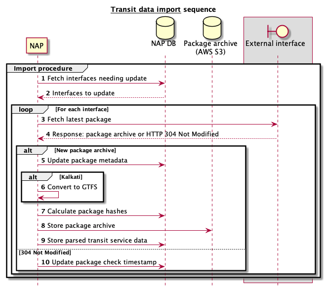
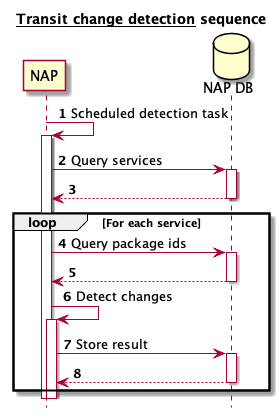

# Transit changes documentation

All changes in transit traffic must be informed to the transit authorities 60 days in advance.
If the data is available from machine readable interfaces, changes will be automatically detected
and transit authorities notified. If a proper interface is not available for a transit service, the
changes must be notified by filling out a manual form.

To facilitate automatic change detection, NAP reads existing transit route and schedule information
from interfaces provided by transport operators and stores them.

## Data gathering

### Interfaces

Interfaces are added by transport operators to their service info using the service form.
Currently, we support [GTFS](https://developers.google.com/transit/gtfs/) and [Kalkati.net](http://developer.matka.fi/pages/en/kalkati.net-xml-database-dump.php) formatted interfaces for route and schedule information.

### Storage

Interface data is always stored in GTFS format. We archive the raw GTFS zip files in AWS S3 bucket. This enables us to fetch older historical data if so required in future.
During the import process, GTFS files are parsed and stored into our relational database model in AWS RDS. The model is not exact mirror of the GTFS standard, but it is logically very similar.
It contains all the same information. GTFS import process does not support other optional GTFS files than calendar_dates.txt and shapes.txt.

### Background process

The import process described above runs every night during night hours. The process tries to update any interface data that has not been updated during 24 hours.
The process queries the interface server for new data. If the server indicates that the data has changed, a new package will be downloaded and processed.
For this process we utilize `If-None-Match` or `If-Modified-Since` HTTP headers.
Relevant package meta data, such as ETAG and current timestamp is stored during this process.

If there are any errors encountered while fetching the new package or during the import process, the interface will be marked as erroneous.
First, we check that if the interface URL can be connected to. Then we download the package and check that the downloaded file is a ZIP file and if it contains all the required GTFS or Kalkati.net files depending on the specified interface format. 

Kalkati.net formatted interfaces are converted into GTFS before storing and importing the data. 
For this, we utilize a kalkati->gtfs converter that parses a Kalkati.net XML-file and outputs a GTFS zip.

After GTFS data has been imported from the interface package, the import process will compute hashes that condense the traffic information stored in the package.
These hashes will be used later in the change detection process where we compare hashes instead of raw traffic data. The hashes will be computed per day.
The hash compresses the traffic per one route during a one day. This includes all the related stop names and stop times used by the route trip stop sequences.

Above is a basic diagram about database tables related to the transit changes process.

## Change detection

After GTFS data has been imported into our database and hashes are computed, we can utilize the hashes in the detection algorithm.
The detection algorithm tries to detect changes in traffic patterns in 60 days in future. The main point of this detection process is to provide transport authorities enough information,
so they can decide when to order more traffic if so required. Transport authorities also use this change information for oversee that all changes are reported before 60 day time period as required by law.

### Background process

The change detection process runs every night after the data gathering process.
First, it fetches a list of regular scheduled passenger transport services that have
a previously calculated change somewhere in future (or it has not yet computed at all)
and have a package that is newer than a previously computed change.

Transit changes are computed one by one for each fetched service using the detection algorithm.

### Detection algorithm

1. **Fetch route data**  
   The detection algorithm processes one transport service per time. It fetches all the routes per service including 
   information about route start and end times and the generated route hashes.
    1. From this data all the routes that are already ended are removed from further inspection.
    
1. **Find the first different week in traffic**  
   Next, the algorithm compares current week and the first week with different traffic somewhere in future.
   In order to find the first different week, daily traffic of each week is compared and the process tries to find a week
   from future that has different daily traffic. The daily route hashes are utilized in this process as they provide 
   an unique signature of the traffic during a specific day.
    1. Note: Detection skips temporary different weeks in this process, caused by christmas holidays and such, to prevent
       false positives in detection results.
   
   **No different weeks found**  
   If the algorithm does not find a different week, it can determine if the route is starting or ending using the start
   and end times information related to the route. If the currently inspected route has a start date in future the
   algorithm marks it as a new route. If the route has an ending date within 90 days, it is marked as an ending route.
   Otherwise the algorithm assumes that there is no changes in the route.
   
   **A differing week was found**  
   If there is a different week in future, the alorighm starts comparing specific dates of the week in more depth per 
   route.

1. **Compare differing dates**  
   After the process has found a week in future that has different traffic than current week, the first day is picked 
   from the different week that starts the new traffic pattern. Then, the process picks the matching week day from
   current week and compares the traffic of these two days in depth.
   The in-depth comparison of the two differing days generates trip, stop sequence and stop time differences per route.
    
    1. **Trip differences**  
       
      
       The algorithm fetches trips of route for the current day and the different week day. The trip comparison works in the
       following way. First, it tries to find the first common stop that is in every trip. Then the trips of the compared days
       are combined using the common stop as a basis. This helps lining up the trip stop times next to each other so they
       can be easily compared. In the merging process, time differences of the trip stop time pairs are computed.
       Any compared trip stop time that is not within 30 minute time window causes the algorithm to mark the
       trip either added or removed.
      
    1. **Stop sequence differences**  
      Stop sequence differences are computed per compared trip pair. The algorithm detects stops that are added or
      removed from a trip by comparing the stop sequences of the trips.
      
    1. **Stop time differences**  
      Stop time differences are computed per compared trip pair. The departure time differences are computed for each 
      matching stop pair.
 

### Notifications

Notifications about newly detected transit changes are sent via email to transit authorities each day.

